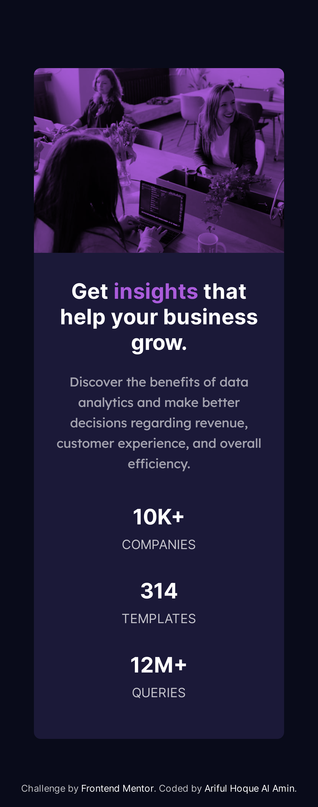

# Frontend Mentor - Stats preview card component solution

This is a solution to the [Stats preview card component challenge on Frontend Mentor](https://www.frontendmentor.io/challenges/stats-preview-card-component-8JqbgoU62). The designs were created to the following widths:

- Mobile: 375px
- Desktop: 1440px

## Table of contents

- [Overview](#overview)
  - [The challenge](#the-challenge)
  - [Screenshot](#screenshot)
  - [Links](#links)
- [My process](#my-process)
  - [Built with](#built-with)
- [Author](#author)

## Overview

### The challenge

Users should be able to:

- View the optimal layout depending on their device's screen size

### Screenshot

### Links

- Solution URL: [Solution](https://github.com/Ar1f007/fmentor-stats-preview-card-component)
- Live Site URL: [Visit](https://stats-preview-card-component-ar1f007.vercel.app/)

## My process

### Built with

- Semantic HTML5 markup
- CSS custom properties
- Flexbox
- Mobile-first workflow
- SCSS

## Author

- Frontend Mentor - [@Ar1f007](https://www.frontendmentor.io/profile/Ar1f007)
- Twitter - [@Ar1f007](https://twitter.com/Ariif_007)
- Instagram - [@\_4r1f](https://www.instagram.com/_4r1f)
